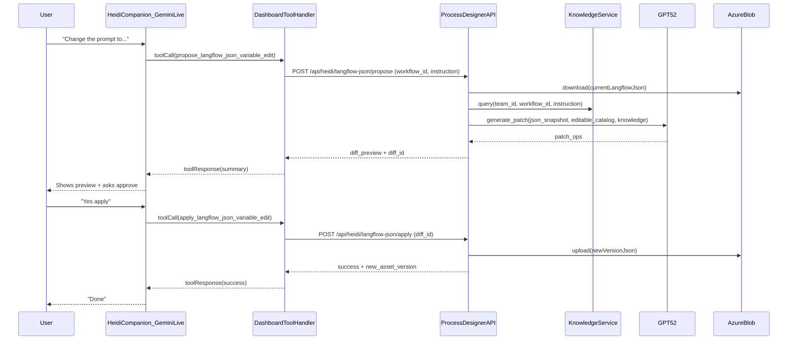

# HEIDI Companion-driven Langflow JSON Variable Editing (GPT‑5.2)

## What you asked for (confirmed)

- Use **HEIDI Companion** to drive the interaction.
- Source of truth is **Langflow JSON files** stored by Process Designer API.
- Store JSON in **Azure Blob** (metadata in Cosmos).
- v1 scope: **edit variables only** (prompts/fields), **do not change nodes/edges**.
- Use **GPT‑5.2** for the edit operation (like SOP edit).

## Key architectural discovery (why the plan changes)

Your HEIDI Companion is already a **Gemini Live voice agent** with tool-calling in the dashboard (`useHeidiLiveSession.ts`). It can call custom tools such as `execute_workflow_command` and `propose_workflow_command`. So the Langflow JSON editor must be exposed as a **new HEIDI Companion tool**, not just as a backend endpoint.

## Target flow (end-to-end)

1. **User (voice/text)** asks HEIDI: “Update the prompt in this flow…”
2. **HEIDI Companion (Gemini Live)** triggers a tool call, e.g. `propose_langflow_json_variable_edit`.
3. The dashboard tool handler calls **Process Designer API**.
4. The API loads the current Langflow JSON from **Azure Blob**, retrieves workflow knowledge via **KnowledgeService**, then calls **GPT‑5.2** to generate a strictly validated **patch set**.
5. The API returns a **diff preview**; HEIDI presents it.
6. On explicit user approval, HEIDI calls `apply_langflow_json_variable_edit` to write a new JSON version to Blob.



## Backend changes (Process Designer API)

### 1) Storage: Langflow JSON assets in Azure Blob + Cosmos metadata

- Add Cosmos container `langflow_json_assets` (metadata only).
- Blob naming: `langflow_json/{team_id}/{workflow_id}/{asset_id}_v{version}.json`.
- Extend `[c:\Workspace PD\process-designer-api NEW\services\azure_blob_service.py](c:\Workspace PD\process-designer-api NEW\services\azure_blob_service.py) `with a **`download_bytes(blob_name)`** helper.

### 2) HEIDI Companion editing endpoints (authenticated)

Add endpoints under `[c:\Workspace PD\process-designer-api NEW\api\heidi.py](c:\Workspace PD\process-designer-api NEW\api\heidi.py)`:

- `POST /api/heidi/langflow-json/upload` (optional v1 if you already have upload elsewhere)
- `POST /api/heidi/langflow-json/propose`
- `POST /api/heidi/langflow-json/apply`

These are meant to be called by the **dashboard HEIDI Companion tool handler**.

### 3) HEIDI Companion editing endpoints (embed/public)

Mirror the same capability for the embedded widget via `[c:\Workspace PD\process-designer-api NEW\api\heidi_embed.py](c:\Workspace PD\process-designer-api NEW\api\heidi_embed.py) `using `validate_embed_origin()`:

- `POST /embed/heidi/langflow-json/propose`
- `POST /embed/heidi/langflow-json/apply`

(So the HEIDI companion in embed mode can also edit the flow for the embed-default workflow.)

### 4) GPT‑5.2 edit engine (variable-only)

Create a new service similar to SOP editor:

- `[c:\Workspace PD\process-designer-api NEW\services\heidi_langflow_json_service.py](c:\Workspace PD\process-designer-api NEW\services\heidi_langflow_json_service.py)`
- Builds **editable catalog** (v1: Prompt nodes’ `template.value`; later can expand)
- Calls GPT‑5.2 (reuse the same Azure OpenAI config approach as `edit_sop_content`)
- Validates patch ops with invariants:
    - No node/edge id changes
    - Node/edge counts unchanged
    - Only allowlisted JSON paths updated

Reference for the Prompt field path (example template):

```317:402:c:\Workspace PD\process-designer-api NEW\api\langflow_templates\Basic Prompting.json
"template": {
  "_input_type": "PromptInput",
  "type": "prompt",
  "value": "Answer the user as if you were a GenAI expert..."
}
```

## Frontend changes (Process Designer Dashboard) — HEIDI Companion

### 1) Add new HEIDI tool declarations

In `[c:\Workspace PD\process-designer-dashboard NEW\client\src\hooks\useHeidiLiveSession.ts](c:\Workspace PD\process-designer-dashboard NEW\client\src\hooks\useHeidiLiveSession.ts)`:

- Add function declarations:
- `propose_langflow_json_variable_edit` (args: `instruction`, optional `target_node_name`, etc.)
- `apply_langflow_json_variable_edit` (args: `diff_id`, `confirm=true`)

### 2) Handle tool calls by calling the backend

In the same file’s `onmessage` tool-call handler, add branches to:

- Call API `POST /api/heidi/langflow-json/propose`
- Display/queue the diff preview in the companion UI
- On apply, call `POST /api/heidi/langflow-json/apply`

### 3) Surface preview + approval UX in HEIDI Companion panel

In `[c:\Workspace PD\process-designer-dashboard NEW\client\src\components\heidi\HEIDICompanion.tsx](c:\Workspace PD\process-designer-dashboard NEW\client\src\components\heidi\HEIDICompanion.tsx)`:

- Reuse the existing “proposal” pattern (like workflow command proposals) to show:
- Changed fields (node display name, old/new values)
- Approve/Reject buttons

## Implementation todos