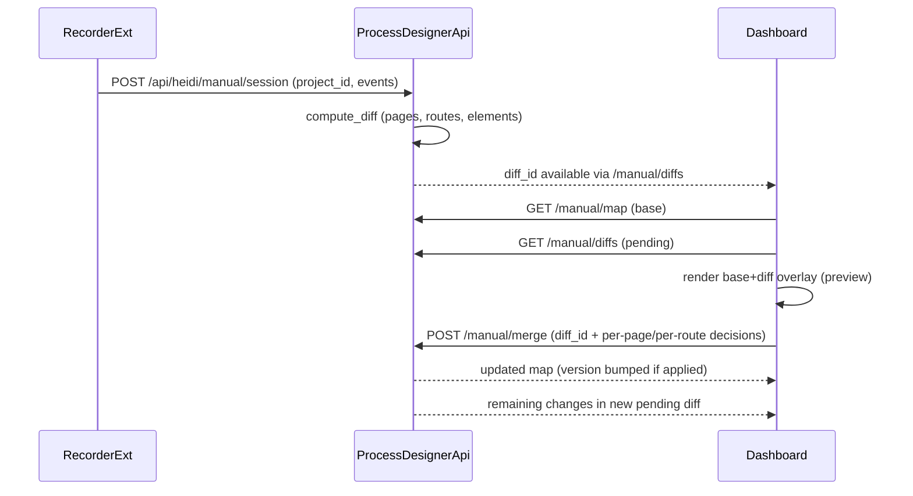

# HEIDI Manual Map: preview + partial approvals

## Goals

- Show **pending changes on the map before approval** (base map + diff overlay).
- Make **suggested changes visually distinct** (different styles for pending/approved/rejected in the review UI).
- Support **partial approval** at two levels (per your answer):
- **Pages** (page nodes)
- **Routes** (page→page `navigates_to` edges)
- **Versioning rules**:
- If at least one item is merged into the map, increment version.
- If nothing is merged (pure rejection / no-op), do not increment.
- On partial approval, apply selected items now and keep the rest pending for later review.

## Backend changes (Process Designer API)

- **Extend merge request model** in [`process-designer-api NEW/api/heidi.py`](process-designer-api%20NEW/api/heidi.py):
- Keep backward compatibility with current `{ diff_id, approve }`.
- Add an optional decisions payload (e.g. `page_decisions`, `route_decisions`) to support partial merges.
- **Enhance diff records** in [`process-designer-api NEW/services/heidi_manual_service.py`](process-designer-api%20NEW/services/heidi_manual_service.py):
- Represent each proposed item as a mergeable unit:
    - Page items: `type=page`, `node_id`
    - Route items: `type=navigates_to`, `edge_id`, `source_page_id`, `target_page_id`
- Implement `merge_diff_partial(...)` behavior:
    - Load base map for the project.
    - Apply approved pages/routes (and required dependencies: approving a route auto-includes its source/target page nodes if missing).
    - Bump map version only if at least one structural change is applied.
    - Mark the current diff as `partially_applied` (or similar) and write an audit trail of decisions.
    - Create a **new pending diff** containing the remaining (unreviewed) items with updated `base_version` to match the new map version.
- **Fix merge reliability in Cosmos** in [`process-designer-api NEW/services/cosmos_service.py`](process-designer-api%20NEW/services/cosmos_service.py):
- Ensure point reads/writes work even if partition keys differ across containers by:
    - Falling back to cross-partition query on read when `read_item` fails.
    - Supplying the correct partition key when replacing items.
- Convert common concurrency/ETag conflicts to **409** with an actionable message.

## Frontend changes (Dashboard Manual Map page)

- Update [`process-designer-dashboard NEW/client/src/pages/assistance/manual-map.tsx`](process-designer-dashboard%20NEW/client/src/pages/assistance/manual-map.tsx) to support a **diff preview overlay**:
- Compute `previewNodes/previewEdges = baseMap + selectedDiff.add` (instead of rendering only base map).
- Add a “Review changes” panel:
    - List **new pages** and **new routes** (navigates_to) with tri-state controls: Approve / Reject / Leave pending.
    - Provide “Approve selected”, “Reject selected”, and “Reset decisions”.
- In the graph, visually distinguish:
    - Pending items (e.g. dashed/outlined)
    - Approved selections (highlight)
    - Rejected selections (dim/red outline)
- On submit, call the enhanced merge endpoint with the decision payload; then refresh:
    - `GET /api/heidi/manual/map?project_id=...`
    - `GET /api/heidi/manual/diffs?project_id=...`

## Recorder (ensuring routes exist)

- Verify the web recorder’s Manual Mode produces `navigation` events so `navigates_to` edges appear.
- If missing, extend [`process-designer-chrome-extension OLD and NEW/content.js`](process-designer-chrome-extension%20OLD%20and%20NEW/content.js) manual-mode capture to emit explicit navigation events on URL changes (popstate/hashchange/pushState) so route-level review is meaningful.

## Data flow (high level)

